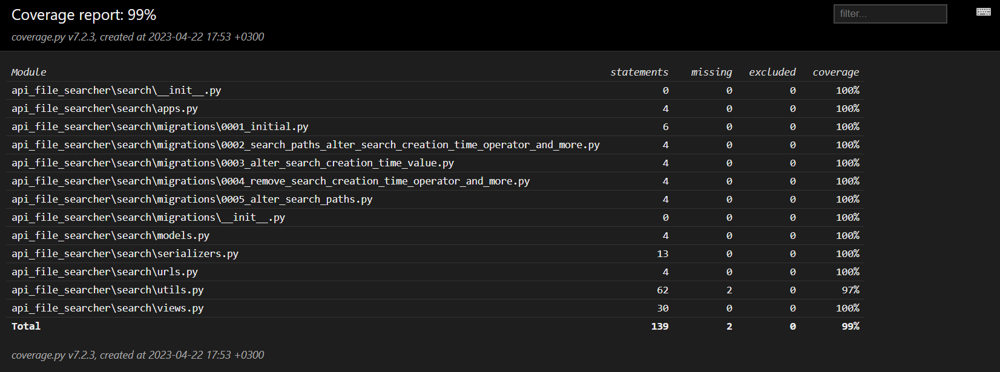

<h1 align="center"> File Search API </h1>

<p align="center">
  <a href="https://img.shields.io/badge/python-3670A0?style=for-the-badge&logo=python&logoColor=ffdd54">
    
  </a>
  <a href="https://img.shields.io/badge/django-%23092E20.svg?style=for-the-badge&logo=django&logoColor=white">
    
  </a>
  <a href="https://img.shields.io/badge/DJANGO-REST-ff1709?style=for-the-badge&logo=django&logoColor=white&color=ff1709&labelColor=gray">
    
  </a>
  <a href="https://img.shields.io/badge/sqlite-%2307405e.svg?style=for-the-badge&logo=sqlite&logoColor=white">
    
  </a>
  <a href="https://img.shields.io/badge/github%20actions-%232671E5.svg?style=for-the-badge&logo=githubactions&logoColor=white">
    
  </a>
</p>

<p align="center">
  <a href="https://badgen.net/badge/python/3.10 | 3.11/blue">
      
  </a>

  <a href="https://codecov.io/gh/aaaaaaaalesha/api_file_search" > 
       
  </a>
   <a href="https://wakatime.com/badge/user/0e21c3c1-25e0-47ee-9c0f-77ef4b6b71e2/project/d35ca18a-238f-49d8-a7ea-3126f604222c">
      
   </a>
</p>

## Описание проекта

Реализация HTTP сервера с API поиска файлов по локальной файловой системе.

- API обрабатывает два вида запросов: создать поиск файлов, получить результаты поиска;
- ответом на создание поиска файлов является идентификатор поиска;
- ответом на получение результатов поиска должен быть либо список путей к файлам, либо информация о том, что поиск ещё
  не завершился;
- пользователь может указывать параметры поиска, такие как:
    - **_текст_**, который должен содержаться в файле, чтобы файл попал в результаты поиска. Под
      текстом понимается строка в кодировке `UTF-8`. Вхождение строки проверяется **во всех** удовлетворяющих фильтрам
      файлах,
      даже если это **не текстовые файлы**;
    - строковая **_маска_** имени файла в формате [glob](https://en.wikipedia.org/wiki/Glob_(programming)#Syntax);
    - **_размер_** файла в байтах и оператор поиска, который может быть одним из следующих ключей:
        - `"eq"` - "равно" (значение по умолчанию),
        - `"gt"` - "больше",
        - `"lt"` - "меньше",
        - `"ge"` - "больше или равно",
        - `"le"` - "меньше или равно";
    - **_время создания_** файла в виде строки в формате RFC 3339 и оператор поиска (см. выше);

  если свойства файла удовлетворяют фильтрам, то такой файл попадает в результаты поиска;
- сервер осуществляет поиск только внутри определённой директории, **которая задаётся в переменной окружения** `SEARCH_DIR`.
- сервер также ищет файлы внутри _zip_-архивов. Вложенные архивы не обрабатываются в соответствии с заданием.
- написанный код покрыт набором тестов с использованием `pytest`.

## Установка

**❗ВАЖНО❗** 
- В проекте используется обновлённое аннотирование типов, доступное с **Python 3.10** и выше.
- Команды для установки/запуска приведены для Linux/Mac OS, для Windows могут незначительно отличаться.

Как развернуть проект у себя.

1. Перейдите в каталог с проектом:

```shell
cd ./api_file_search
```

2. Создайте и активируйте виртуальное окружение:

```shell
python3 -m venv venv
. venv/bin/activate
```

3. Установите необходимые зависимости:

```shell
python3 -m pip install --upgrade pip
pip install -r requirements.txt
```

4. Выполните миграции

```shell
cd api_file_searcher
python3 manage.py makemigrations
python3 manage.py migrate
cd ..
```

5. (Опционально) Создайте файл `.env` с переменными окружения:

```shell
touch ./api_file_searcher/.env
```

пример-шаблон содержимого файла `.env`:

```
# Директория поиска.
SEARCH_DIR=../tests/test_searchdir
# Секретный ключ Django проекта.
SECRET_KEY=@hz@h4rtk4e$-%-8t@w9lkqc30u!o$0p
# Режим отладки сервера Django.
DEBUG=False
```

6. Запустите сервер

```shell
python3 ./api_file_searcher/manage.py runserver
```

## Примеры

Примеры запросов к API поиска файлов.

### 1. Создание поиска файлов

`[POST] /search`

Создание поиска файлов. Сервер производит десериализацию параметров из JSON и производит поиск в соответствии с
этими фильтрами. По завершении поиска `search_id = UUID` записывается в базу данных вместе с найденными
относительными путями до файлов.
Если тело запроса содержит невалидный JSON, сервер вернёт код ошибки клиента `400 (Bad Request)`.

Спецификацию фильтров можно посмотреть в разделе **"Описание проекта"** выше.

Стоит отметить, что каждый из фильтров является опциональным. Так если не передать какой-то параметр, он просто не будет
учитываться при фильтрации.

#### 1.1 Пример корректного запроса: `[POST] /search`

```json
{
  "text": "std::",
  "file_mask": "[!u]*.hpp",
  "size": {
    "value": 1213,
    "operator": "gt"
  },
  "creation_time": {
    "value": "2022-09-13T11:00:00Z",
    "operator": "ge"
  }
}
```

- `Status Code: 201`

```json
{
  "search_id": "4fb3ea17-e113-11ed-b33a-d45d643cf57f"
}
```

#### 1.2 Пример некорректного запроса: `[POST] /search`

```json
{
  "text": 1,
  "file_mask": false,
  "size": 10,
  "creation_time": 10e-10
}
```

- `Status code: 400`

### 2. Получить результаты поиска

`[GET] /searches/<search_id>`

Получение результатов поиска на основе POST-запроса, отправленного ранее.

#### 2.1 Пример ответа с успешным поиском (см. фильтры в примере 1.1):

`[GET] /searches/4fb3ea17-e113-11ed-b33a-d45d643cf57f`

- `Status Code: 200`

```json
{
  "finished": true,
  "paths": [
    "unordered_map/iterator.hpp",
    "unrolled_linked_list/array.hpp",
    "unrolled_linked_list/iterator.hpp"
  ]
}
```

#### 2.2 Пример ответа, если ничего не найдено:

`[GET] /searches/262b119e-e117-11ed-8a47-d45d643cf57f`

- `Status Code: 200`

```json
{
  "finished": true,
  "paths": []
}
```

#### 2.3 Пример ответа, если поиск ещё не завершился:

`[GET] /searches/bd65600d-8669-4903-8a14-af88203add38`

- `Status Code: 200`
-

```json
{
  "finished": false
}
```

## Тестирование

Для запуска тестов необходимо:

1. Выполнить пункты 1-4 раздела "**Установка**".
2. Выполнить в корне проекта запуск тестов `pytest`:

```shell
pytest
```

```shell
django: settings: api_file_searcher.settings (from ini)
rootdir: B:\github\api_file_search, configfile: pytest.ini, testpaths: tests/
plugins: cov-4.0.0, django-4.5.2, pythonpath-0.7.4
collected 6 items

tests/test_search.py::TestSearchAPI::test_search_not_found PASSED                                                                                                                                                                            [ 16%] 
tests/test_search.py::TestSearchAPI::test_searches_not_finished PASSED                                                                                                                                                                       [ 33%] 
tests/test_search.py::TestSearchAPI::test_invalid_request PASSED                                                                                                                                                                             [ 50%] 
tests/test_search.py::TestSearchAPI::test_search_all PASSED                                                                                                                                                                                  [ 66%] 
tests/test_search.py::TestSearchAPI::test_search_python_files PASSED                                                                                                                                                                         [ 83%] 
tests/test_search.py::TestSearchAPI::test_complex_search PASSED                                                                                                                                                                              [100%] 

---------- coverage: platform win32, python 3.11.2-final-0 -----------
Coverage HTML written to dir htmlcov


================================================================================================================ 6 passed in 1.32s ================================================================================================================ 
```

Также автоматически произойдёт сборка данных о покрытии кода тестами в каталоге `./htmlcov`.
Посмотреть отчёт о покрытии можно, открыв файл `./htmlcov/index.html` с помощью вашего любимого браузера.



## Автор

Copyright © 2023, Алексей Александров, [github.com/aaaaaaaalesha](https://github.com/aaaaaaaalesha)
